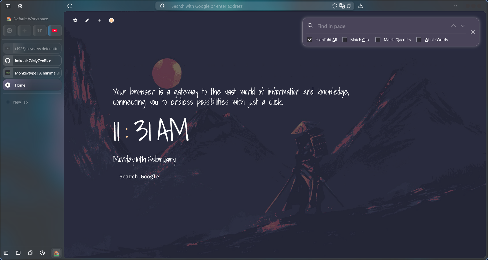

# My Zen Browser Rice

## Screenshots

##

##

##

A project to enhance and personalize the Zen Browser with unique themes and configurations. This customization integrates **Natsumi's configurations** and **SAJI-01's customized userChrome** for a tailored and seamless browsing experience.

## What's New
- Fixed several issues from the original configurations to improve stability and functionality.
- Enhanced the themes for a more polished and visually appealing look.
- Improved userChrome.css for better compatibility and smoother navigation.
- Included my nightTab Backup.

## Source Links
- [Natsumi's Zen Browser Configuration](https://github.com/greeeen-dev/natsumi-browser)
- [SAJI-01's Customized Zen Browser Theme](https://github.com/SAJI-01/MyZenTheme?tab=readme-ov-file)

##
Bring the Zen back into your browsing with these powerful customizations and fixes. ✨
